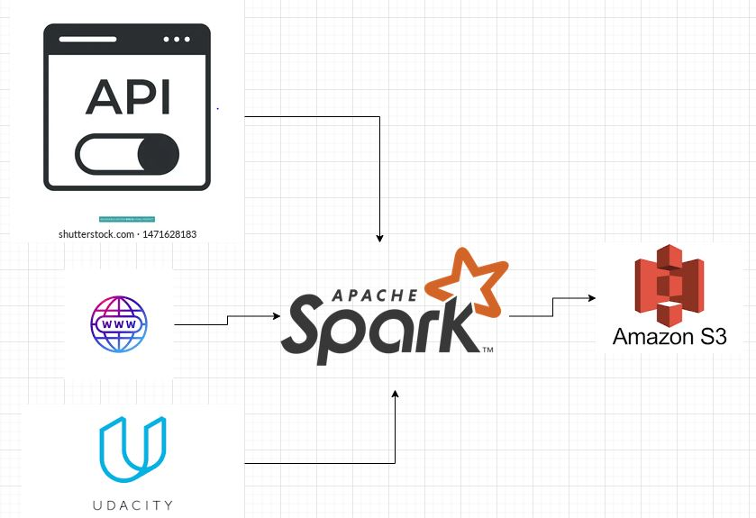

# Udacity Data Engineering Capstone Project


## Contents

1. [Summary](#Summary)  
2. [Data Sources](#data-sources)  
3. [Data Model](#data-model)   
4. [ETL Pipeline](#etl-pipeline)
6. [Structure of the project](#structure-of-the-project)

## Summary

This project aims to create an ETL pipeline that takes data from 7 sources, processes them and uploads them to a data warehouse. The data warehouse facilitates the analysis of the US immigration phenomenon using Business Intelligence applications. With the help of the data stored in it, it is possible to identify:
-  find the country with the highest number of immigrants 
-  find the number of immigrants based on visa_type


The code tested on udacity data enginnering workspace.

## Data Sources

7 data sources are used in this project. 4 of them are suggested by Udacity  Project and 3 of them are taken from various web pages. A small description of each of them can be found below:
The following datasets are included in the project workspace. We purposely did not include a lot of detail about the data and instead point you to the sources. This is to help you get experience doing a self-guided project and researching the data yourself. If something about the data is unclear, make an assumption, document it, and move on. Feel free to enrich your project by gathering and including additional data sources.

- I94 Immigration Data: This data comes from the US National Tourism and Trade Office. A data dictionary is included in the workspace. This is where the data comes from. There's a sample file so you can take a look at the data in csv format before reading it all in. You do not have to use the entire dataset, just use what you need to accomplish the goal you set at the beginning of the project.
- World Temperature Data: This dataset came from Kaggle. You can read more about it here.
- U.S. City Demographic Data: This data comes from OpenSoft. You can read more about it here.
- Airport Code Table: This is a simple table of airport codes and corresponding cities. It comes from here.
- [Country Codes](https://countrycode.org/): This site provides the name and 2-letter code of all countries in the world.
- [US States Codes](https://www23.statcan.gc.ca/imdb/p3VD.pl?Function=getVD&TVD=53971):  This site provides the name and 2-letter code of all US states.
- [Continent Codes](https://www.php.net/manual/en/function.geoip-continent-code-by-name.php): This site provides the name and 2-letter code of all continents.

## ETL Model


<p align="center">
  
</p> 


- **globalcity tempature evalution**: is a dimension table whose data source is the World Temperature Data dataset. It stores the average monthly temperatures of each country from 1743 to 2013.
- **demographic**: is a dimension table whose data source is the U.S. City Demographic Data dataset. It contains population data for each US state.
- **world_airports**: is a dimension table whose data sources are the Airport Code Table and Continent Codes datasets. It contains data about all airports in the world.
- **us_states**: is a dimension table whose data source is the US States Codes dataset. It contains the name and 2-letter code of all US states.
- **visa**: is a table of dimensions whose data source is the I94 Immigration Data dataset and its description file. It contains all valid visa information.
- **applicant_origin_country**: is a dimension table whose data source is the description file in the I94 Immigration Data dataset. It contains a 3-digit code and the name of each country from which an immigrant could come.
- **status_flag**: is a dimension table whose data source the I94 Immigration Data dataset. It contains the one-letter status for different stages that the immigrant went through.
- **admission_port**: is a dimension table whose data source is the description file in the I94 Immigration Data dataset. It contains the code and information about the admission port through which the immigrant passed.
- **arrival_mode**: is a table of dimensions whose data source is the I94 Immigration Data dataset and its description file. It contains information about how the immigrant arrived in the US.
- **date**: is a dimension table whose data source the I94 Immigration Data dataset. It contains all possible dates from the columns in the source dataset.
- **immigran_application**: is the fact table in the data model. It has as a data source both the I94 Immigration Data dataset and the *visa*, *status_flag* and *arrival_mode* tables from which it takes the id columns. This table contains information on the application submitted by the immigrants.


### tools used -

- Spark - To process large files
- S3 - to store data as datalake
- Pandas - to analyse data in dataframes

  
To run the pipeline, the next steps have to be followed:
1. Complete **dl.cfg** configuration file. 
2. Run the command from the project root.
```
python -m etl
```

## Other Scenarios

#### The data was increased by 100x.

For such a scenario, use [Amazon EMR](https://aws.amazon.com/emr/) to run the ETL.

#### The data populates a dashboard that must be updated on a daily basis by 7am every day.

For this situation, the ETL can be refactor to work with [Apache Airflow](https://airflow.apache.org/), because it would be much easier to automate the execution of the pipeline.

#### The database needed to be accessed by 100+ people.

If the database starts to be used intensively, use [Amazon Redshift](https://aws.amazon.com/redshift/).

